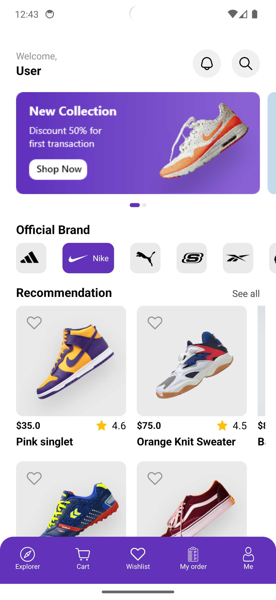
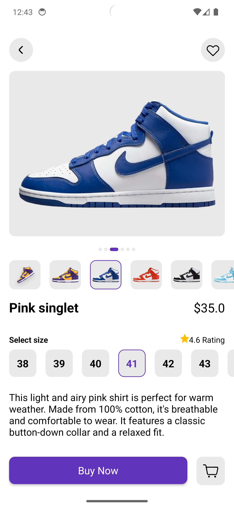
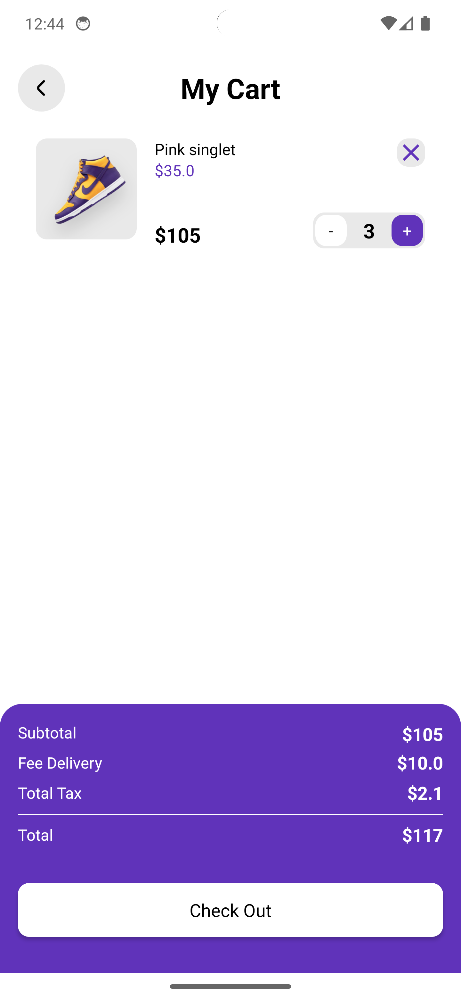

# ShoeStore

ShoeStore is an Android application designed to provide users with a seamless shoe shopping experience. The app features a robust architecture, integration with Firebase services, and various activities to enhance user interaction. 

## Table of Contents
- [Features](#features)
- [Architecture](#architecture)
- [Technologies Used](#technologies-used)
- [Activities](#activities)
- [Screenshots](#screenshots)
- [Installation](#installation)
- [Usage](#usage)
- [Contributing](#contributing)
- [License](#license)

## Features
- **MVVM Architecture**: Ensures separation of concerns and better testability.
- **Firebase Integration**: Utilizes Firebase Realtime Database, Storage, and Authentication.
- **User Authentication**: Supports user sign-up, sign-in, and authentication management.
- **Real-time Updates**: Syncs data in real-time with Firebase Realtime Database.
- **Notification Support**: Sends notifications to keep users informed about offers and updates.

## Architecture
The project follows the Model-View-ViewModel (MVVM) architecture, which helps in separating the user interface logic from business logic and data handling. This architecture enhances the maintainability and scalability of the codebase.

## Technologies Used
- **Kotlin**: The primary language for Android development.
- **Firebase**:
  - **Realtime Database**: For real-time data synchronization.
  - **Storage**: For storing images and other media files.
  - **Authentication**: For managing user authentication and authorization.
- **Android Jetpack Components**:
  - **LiveData**: For data binding.
  - **ViewModel**: For managing UI-related data.
  - **Navigation Component**: For navigation between activities.

## Activities
The application consists of the following activities:

1. **SplashScreenActivity**: Displays a splash screen while the app is loading.
2. **IntroActivity**: Introduces the app to new users with a brief overview.
3. **SignInActivity**: Allows users to sign in using their credentials.
4. **SignUpActivity**: Facilitates user registration.
5. **MainActivity**: The main hub of the app where users can browse shoes.
6. **DetailActivity**: Displays detailed information about a selected shoe.
7. **CartActivity**: Manages the user's shopping cart.
8. **NotificationActivity**: Displays notifications and updates.
9. **SearchActivity**: Provides a search interface to find specific shoes.
10. **BaseActivity**: A base class for other activities, providing common functionality.


## Installation
To get started with ShoeStore, follow these steps:

1. **Clone the repository**:
   ```sh
   git clone https://github.com/DAV1TM/ShoeStore.git
   ```

2. **Open the project in Android Studio**:
   ```sh
   cd shoestore
   ```

3. **Configure Firebase**:
   - Create a new project in [Firebase Console](https://console.firebase.google.com/).
   - Add your Android app to the Firebase project.
   - Download the `google-services.json` file and place it in the `app` directory.

4. **Build and run the project**:
   - Open Android Studio.
   - Build the project and run it on an emulator or a physical device.

## Usage
Once the app is installed and running, you can:

- **Browse Shoes**: View a variety of shoes available in the store.
- **Search**: Use the search functionality to find specific shoes.
- **View Details**: Click on any shoe to view its details.
- **Add to Cart**: Add your desired shoes to the cart.
- **Manage Cart**: View and manage items in your cart.
- **Notifications**: Stay updated with the latest offers and notifications.

## Contributing
Contributions are welcome! Fork this repository to contribute.

## License
This project is licensed under the MIT License. See the [LICENSE](LICENSE) file for more details.

## Screenshots
Here are some screenshots from the application:






